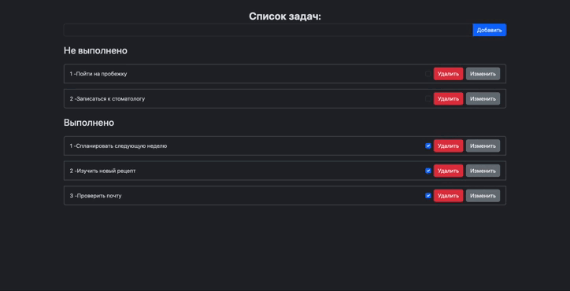

# MyTodoApp

## Описание
MyTodoApp — это приложение для управления задачами (todo list), которое поможет вам легко организовать свои ежедневные дела. Разработано с использованием SSR.

Основные функции:

- **Добавлять задачи** — просто введите и отправьте, чтобы создать новую задачу.
- **Удалять задачи** — удалите ненужные задачи одним нажатием.
- **Редактировать задачи** — изменяйте детали ваших задач для точного управления списком.
- **Отмечать выполненные задачи** — помечайте задачи как выполненные, чтобы следить за вашим прогрессом.

## Технологии
JavaScript, React, Node.js, Express, PostgresSQL

## Установка и запуск
Для запуска приложения, вам потребуется PostgreSQL. Если у вас его еще нет, загрузите и установите PostgreSQL с официального сайта. После установки PostgreSQL, убедитесь, что сервер PostgreSQL запущен.

Для удобного управления базой данных вы также можете установить утилиту администрирования, такую как pgAdmin4 или DBeaver.

Для запуска приложения выполните следующие шаги:

1. Склонируйте репозиторий.
2. Скопируйте файл .env.example и переименуйте его в .env, заменив плейсхолдеры на актуальные значения.
3. Для работы с базой данных выполните следующие команды:

npx sequelize-cli init — инициализация проекта.
npx sequelize db:create — создание базы данных.
npx sequelize db:migrate — выполнение миграций.
npx sequelize seed:generate --name seedAll — создание папки seeders.
npx sequelize db:seed:all — выполнение сидирования данных.

Вы также можете использовать команду npm run db:reset, которая выполняет следующие действия: npx sequelize-cli db:drop && npx sequelize-cli db:create && npx sequelize-cli db:migrate && npx sequelize-cli db:seed:all.

4. Для запуска приложения выполните команду:
npm run start 

